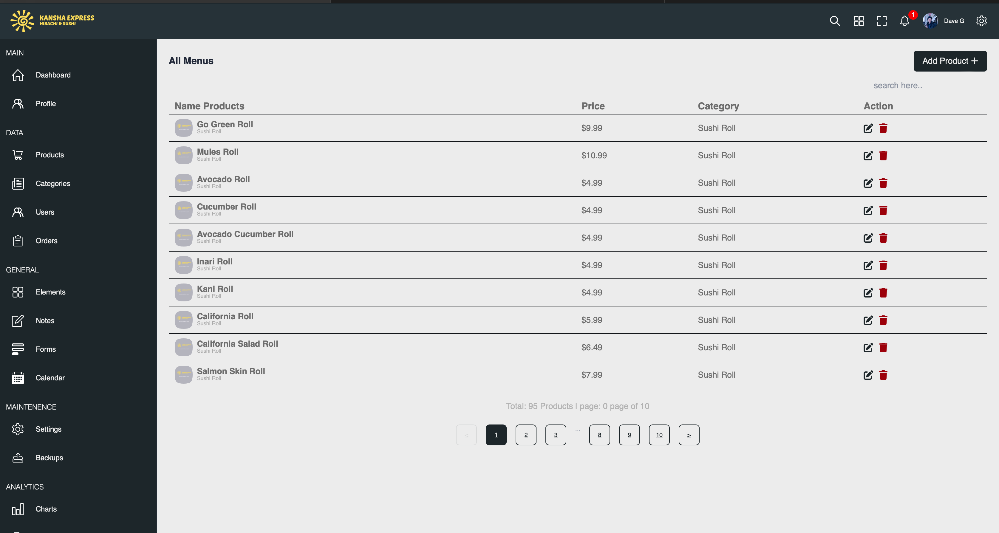

# Website with TypeScript, React, Vite, and More

Welcome to the Website repository! This project showcases a modern and interactive website built using TypeScript, React, Vite, and a stack of powerful libraries and tools. Whether you're a developer looking to learn or someone passionate about creating engaging web experiences, this project has you covered.

## Features

- Dynamic UI components and smooth transitions powered by React.
- Lightning-fast development with Vite's speedy build tooling.
- Secure user authentication using JSON Web Tokens (JWT) for personalized experiences.
- Efficient data fetching and management with Axios.
- Seamless navigation and routing using react-router-dom.
- Stylish and organized styling with Sass and the utility-first Tailwind CSS framework.
- Elegant and intuitive icons from Font Awesome.
- Fluid animations brought to life by Framer Motion.
- Pagination made easy with react-paginate.
- Informative notifications using react-toastify.
- DaisyUI integration for enhancing Tailwind CSS components.

## Technologies Used

- [TypeScript](https://www.typescriptlang.org): Typed superset of JavaScript that compiles to plain JavaScript.
- [React](https://reactjs.org): JavaScript library for building user interfaces.
- [Vite](https://vitejs.dev): Fast build tool that leverages the native module system of modern browsers.
- [JSON Web Tokens (JWT)](https://jwt.io): Secure authentication method for transmitting information between parties.
- [Axios](https://axios-http.com): Promise-based HTTP client for the browser and Node.js.
- [react-router-dom](https://reactrouter.com): Declarative routing for React applications.
- [Sass](https://sass-lang.com): CSS extension language for maintaining clean and organized styles.
- [Font Awesome](https://fontawesome.com): Comprehensive icon set and toolkit, enhancing visual elements.
- [Framer Motion](https://www.framer.com/motion/): Add smooth animations and transitions to elements for an engaging experience.
- [react-paginate](https://www.npmjs.com/package/react-paginate): Easy pagination for React applications.
- [react-toastify](https://fkhadra.github.io/react-toastify): Display stylish notifications to keep users informed.
- [Tailwind CSS](https://tailwindcss.com): Highly customizable CSS framework utilizing utility classes.
- [DaisyUI](https://daisyui.com): Tailwind CSS component library for rapid development.

## Getting Started

1. Clone this repository to your local machine.
2. Navigate to the project directory: `cd website-project`.
3. Install the required dependencies: `npm install`.
4. Set up your authentication configuration in `src/auth.ts`.
5. Configure API endpoints in `src/api.ts`.
6. Run the development server: `npm run dev`.
7. Open your browser and visit: `http://localhost:3000`.

## Contributing

Contributions are welcome! Feel free to open a pull request or an issue if you find any bugs or want to suggest improvements.

## License

This project is licensed under the [MIT License].

---

Developed by [Wanda Azhar](https://github.com/wandaazhar007)
